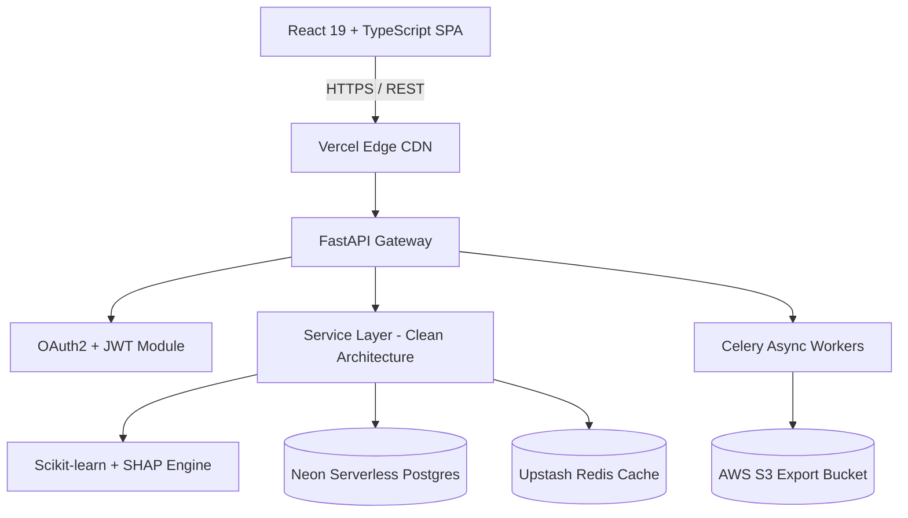

<div align="center">

# AttriSense AI
### *Predict. Understand. Retain.*

[](https://github.com/shiveek/AttriSense-AI/actions)
[](https://fastapi.tiangolo.com)
[](https://react.dev)
[](https://python.org)
[](https://scikit-learn.org)
[](https://www.docker.com)
[](LICENSE)

<p align="center">
  <b>AttriSense AI</b> is an enterprise-grade Decision Intelligence & Workforce Analytics SaaS Platform designed to help organization leaders predict employee flight risk, uncover explainable AI retention drivers, simulate HR intervention policies, and automate proactive talent retention strategies.
</p>

</div>

---

## 🌟 Key Capabilities

- **🔮 Predictive Attrition Scoring**: High-precision machine learning models classify workforce flight risk probability ($0.0\% - 100.0\%$) and categorize employees into `Low`, `Medium`, or `High` risk tiers.
- **🧠 Explainable AI (SHAP TreeExplainer)**: Localized feature attribution maps exact positive and negative force drivers (e.g. *Overtime +24%*, *Low Job Satisfaction +18%*, *Competitive Income -12%*).
- **💡 Actionable Retention Strategy Generator**: Automatically synthesizes SHAP contributions into targeted interventions across compensation, promotion timelines, workload adjustments, and mentorship.
- **🎛️ Interactive "What-If" Risk Simulator**: Real-time policy sandbox enabling HR managers to simulate raise grants, overtime elimination, or role adjustments with instant recalculated risk scores.
- **📊 Executive Workforce Analytics**: Interactive dashboards featuring departmental attrition heatmaps, tenure degradation curves, and performance vs. satisfaction correlation matrices.
- **📑 Asynchronous PDF & Excel Reporting**: Background Celery workers generate executive PDF slide decks and multi-sheet Excel reports stored securely on AWS S3.
- **🔒 Enterprise Security & Auditability**: OAuth2 JWT authentication with fine-grained Role-Based Access Control (RBAC: `Admin`, `HR_Manager`, `Analyst`, `User`) and immutable audit logs.

---

## 🏗️ System Architecture



---

## 🛠️ Technology Stack

| Layer | Technology |
| :--- | :--- |
| **Frontend** | React 19, TypeScript, Vite, Tailwind CSS v4, Framer Motion, Recharts, TanStack Query, Zustand |
| **Backend API** | FastAPI, Python 3.11, Pydantic v2, SQLAlchemy 2.0 ORM, Alembic |
| **Machine Learning** | Scikit-Learn (Random Forest Ensemble), SHAP (`TreeExplainer`), Pandas, NumPy, Joblib |
| **Task Queue & Caching** | Celery 5.4, Redis 7 (Upstash Serverless) |
| **Database** | PostgreSQL 15 (Neon Serverless in production) |
| **Object Storage** | AWS S3 Bucket |
| **Infrastructure** | Docker, Docker Compose, GitHub Actions CI/CD |

---

## 🚀 Quick Start (Local Development)

### Prerequisites
- **Python**: 3.10+
- **Node.js**: v18+ & `npm`
- **Docker**: Version 24+ (Optional for containerized run)

### 1. Clone Repository
```bash
git clone https://github.com/shiveek/AttriSense-AI.git
cd AttriSense-AI
```

### 2. Start Backend Server
```bash
# Create virtual environment
python -m venv backend/venv
source backend/venv/bin/activate  # On Windows: backend\venv\Scripts\activate

# Install dependencies
pip install -r backend/requirements.txt

# Run FastAPI Server
python -m uvicorn backend.app.main:app --reload --port 8000
```
Backend API will be live at: `http://127.0.0.1:8000`  
Swagger API Docs available at: `http://127.0.0.1:8000/docs`

### 3. Start Frontend Web App
```bash
cd frontend
npm install
npm run dev
```
Frontend Web App will be live at: `http://localhost:5173`

---

## 🔑 Default Credentials

The system automatically seeds an initial administrator user and sample workforce records upon first launch:

- **Email**: `admin@attrisense.com`
- **Password**: `admin123`

---

## 🐳 Docker Deployment (Single Command)

To run the entire multi-container production stack locally:

```bash
docker-compose up --build -d
```

This launches:
- `attrisense_db`: PostgreSQL Database (`Port 5432`)
- `attrisense_redis`: Redis Cache (`Port 6379`)
- `attrisense_backend`: FastAPI Gateway (`Port 8000`)
- `attrisense_worker`: Celery Background Worker
- `attrisense_frontend`: Nginx Web Server (`Port 80`)

---

## 🧪 Testing & SRE Verification

### Backend Pytest & SRE Audit
```bash
python -m backend.app.core.verify_production
```

### Frontend TypeScript Check
```bash
cd frontend
npm run build
```

---

## 🌐 Multi-Cloud Production Deployment

- **Frontend SPA**: Deployed to **Vercel** (`vercel.json`).
- **Backend Service**: Deployed to **Railway** (`railway.json`).
- **Database**: **Neon PostgreSQL** Serverless.
- **Cache & Queue**: **Upstash Redis**.
- **Object Storage**: **AWS S3**.

Detailed deployment procedures are available in [docs/deployment_guide.md](docs/deployment_guide.md) and [docs/rollback_strategy.md](docs/rollback_strategy.md).

---

## 📄 License

Distributed under the MIT License. See `LICENSE` for details.
